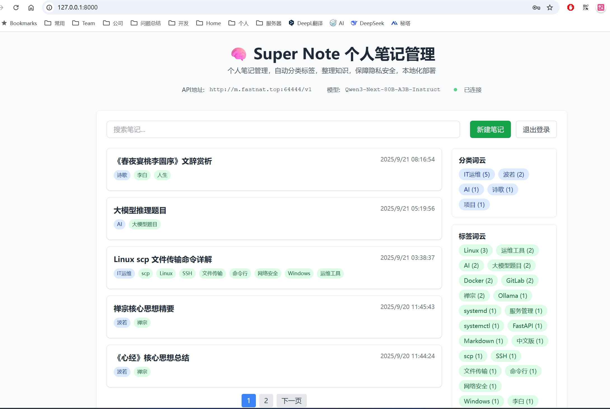

# 智能笔记管理器（note-ai-manager）

一个基于 FastAPI + 原生前端的本地可用「智能笔记」应用：

- AI 自动分析笔记内容并提取「分类、标签」（仅分析前1000字符）
- 一键 AI 优化正文并生成标题（默认不修改内容，仅提取标题、分类、标签）
- 笔记保存到 SQLite 与本地 Markdown 文件，支持全文搜索
- 词云展示热门分类与标签，点击可筛选
- 前后端本地运行，默认无需外网（可接入兼容 OpenAI 的本地/远程模型）

## 基于 GPL（GNU General Public License）协议开源

## 功能特性

- 自动分类与标签：调用兼容 OpenAI 的 API，根据正文前1000字符智能归类并打标签
- 分析标题分类功能：自动提取标题、分类、标签，不修改原文内容
- AI优化重写功能：根据用户输入的提示词优化内容，需要用户提供具体的优化要求
- 全文检索与条件过滤：支持搜索、按分类/标签过滤
- 全屏编辑模式：支持全屏显示笔记，提供更大的编辑空间和更好的阅读体验
- 本地持久化：SQLite 数据库 + `notes/分类/标题.md` 文件
- 纯前端页面：无需构建，打开即可用
- 智能请求管理：AI优化重写请求超时时间延长至2分钟，防重复点击，优化用户体验


## 目录结构

```text
note-ai-manager/
  ├─ backend/               # 后端代码目录
  │  ├─ app/               # FastAPI 应用
  │  │  ├─ main.py         # 应用入口
  │  │  ├─ api/            # API 路由
  │  │  ├─ services/       # 业务逻辑服务
  │  │  ├─ models/         # 数据模型
  │  │  └─ config/         # 配置文件
  │  └─ requirements.txt   # 后端依赖
  ├─ frontend/             # 前端代码目录
  │  └─ js/                # JavaScript 模块目录
  │     ├─ core/           # 核心模块
  │     ├─ components/     # UI 组件
  │     ├─ services/       # 服务模块
  │     ├─ utils/          # 工具函数
  │     └─ models/         # 数据模型
  ├─ index.html            # 主页面
  ├─ frontend/
  │  └─ styles.css         # 样式文件
  ├─ src/input.css         # Tailwind CSS 源文件
  ├─ package.json          # Node.js 依赖
  ├─ tailwind.config.js    # Tailwind 配置
  ├─ data/notes.db         # SQLite 数据库
  └─ notes/                # Markdown 文件按分类分目录存放
```


## 环境要求

- Python 3.10 或更高版本
- Node.js 16 或更高版本（用于构建 Tailwind CSS）
- 可访问一个兼容 OpenAI 的推理服务（任选其一）：
  - 公有云：`https://api.openai.com/v1`（需要有效 Key）
  - 本地/私有：例如 Ollama、OpenAI 兼容网关，提供 `base_url` 与 `api_key`

## 安装说明

### Windows 系统安装

#### 方法一：一键安装（推荐）
1. 确保已安装 Python 3.10+ 和 Node.js 16+
2. 双击运行 `setup.bat` 脚本
3. 等待安装完成，脚本会自动：
   - 安装 Python 依赖
   - 安装 Node.js 依赖
   - 构建 Tailwind CSS
   - 启动服务

#### 方法二：手动安装
```cmd
# 1) 安装 Python 依赖
pip install -r requirements.txt

# 2) 安装 Node.js 依赖
npm install

# 3) 构建 Tailwind CSS
npm run build-css-prod

# 4) 启动服务
python -m uvicorn backend.app.main:app --host 0.0.0.0 --port 8000 --reload
```

#### 方法三：使用批处理脚本
```cmd
# 构建 CSS（开发模式）
build-css.bat

# 构建 CSS（生产模式）
npm run build-css-prod

# 启动服务
run.bat
```

### Linux 系统安装

#### 方法一：一键安装（推荐）
1. 确保已安装 Python 3.10+ 和 Node.js 16+
2. 给脚本添加执行权限并运行：
```bash
chmod +x setup.sh
./setup.sh
```

#### 方法二：手动安装
```bash
# 1) 安装 Python 依赖
pip install -r requirements.txt

# 2) 安装 Node.js 依赖
npm install

# 3) 构建 Tailwind CSS
npm run build-css-prod

# 4) 启动服务
python -m uvicorn backend.app.main:app --host 0.0.0.0 --port 8000 --reload
```

#### 方法三：使用 Shell 脚本
```bash
# 构建 CSS（开发模式）
chmod +x build-css.sh
./build-css.sh

# 构建 CSS（生产模式）
npm run build-css-prod

# 启动服务
chmod +x run.sh
./run.sh
```

### macOS 系统安装

macOS 系统安装步骤与 Linux 相同，请参考上述 Linux 安装方法。

### 验证安装

安装完成后，打开浏览器访问 `http://127.0.0.1:8000`，如果看到登录界面说明安装成功。

## 应用界面预览



*智能笔记管理器主界面 - 支持自动分类标签、全文搜索、词云展示等功能*

## 应用界面预览


*智能笔记管理器主界面 - 支持自动分类标签、全文搜索、词云展示等功能*

### 常见安装问题

#### Python 环境问题
- 确保使用 Python 3.10 或更高版本
- 如果遇到权限问题，使用 `pip install --user -r requirements.txt`

#### Node.js 环境问题
- 确保使用 Node.js 16 或更高版本
- 如果 npm 安装失败，尝试使用 `npm install --legacy-peer-deps`

#### 端口占用问题
- 如果 8000 端口被占用，可以修改启动命令中的端口号
- 例如：`python -m uvicorn backend.app.main:app --host 0.0.0.0 --port 8001 --reload`

#### 权限问题（Linux/macOS）
- 确保脚本有执行权限：`chmod +x *.sh`
- 如果遇到权限问题，使用 `sudo` 运行相关命令


## 前端使用说明

### 模块化架构
前端已重构为模块化架构，主要特点：
- **分离关注点**：HTML、CSS、JavaScript 完全分离
- **组件化设计**：可复用的 UI 组件（模态框、分页、词云等）
- **模块化 JS**：按功能拆分为独立模块，便于维护和扩展
- **响应式设计**：支持移动端和桌面端
- **Tailwind CSS**：使用本地构建的 Tailwind CSS，避免 CDN 警告
- **本地化依赖**：marked.js 和 DOMPurify 已本地化，无需外网连接

### Tailwind CSS 构建说明
项目已从 CDN 版本的 Tailwind CSS 迁移到本地构建版本：

- **开发模式**：`npm run build-css` - 监听文件变化并自动重新构建
- **生产模式**：`npm run build-css-prod` - 构建压缩版本
- **配置文件**：`tailwind.config.js` - 自定义 Tailwind 配置
- **源文件**：`src/input.css` - 包含所有自定义样式和组件
- **输出文件**：`frontend/styles.css` - 最终生成的样式文件

如需修改样式：
1. 编辑 `src/input.css` 文件
2. 运行 `npm run build-css-prod` 重新构建
3. 刷新浏览器查看效果

### 本地化依赖说明
项目已将所有外部 CDN 依赖本地化，确保在无网络环境下也能正常运行：

- **marked.js**：Markdown 解析库，位于 `frontend/assets/libs/marked.min.js`
- **DOMPurify**：HTML 内容净化库，位于 `frontend/assets/libs/purify.min.js`
- **优势**：无需外网连接，加载速度更快，避免 CDN 服务不可用的问题
- **更新**：如需更新依赖版本，可通过 `npm install` 安装新版本后重新复制到 `frontend/assets/libs/` 目录

### 文件说明
- `index.html`：主页面，包含所有 HTML 结构
- `frontend/styles.css`：所有样式定义，包括组件样式和工具类
- `frontend/js/core/app.js`：主应用模块，协调各个模块
- `frontend/js/services/api.js`：API 接口封装，包含错误处理
- `frontend/js/components/`：可复用组件（模态框、分页、词云等）
- `frontend/js/utils/`：工具函数和常量定义

### 使用步骤
1. 首次进入，先在页面顶部的「API 配置」中填写：
   - API 地址（Base URL），例如：`https://api.openai.com/v1` 或你的本地服务地址
   - API Key
   - 默认模型（如 `qwen3:30b-a3b-46k`，可根据你的服务可用模型填写）
2. 登录成功后即可：
   - 新建笔记：输入正文，必要时点击「AI 优化」获取更优表达与标题，然后保存
   - 搜索与筛选：顶部搜索框，右侧词云点击可按分类或标签过滤
   - 预览/优化/更新：点击列表项打开预览，支持再次 AI 优化后保存更新
   - 全屏编辑：在预览弹窗中点击全屏按钮，进入全屏编辑模式，提供更大的编辑空间
   - 删除笔记：在预览弹窗中删除


## 后端 API 文档（简要）

> 基础地址：`/api`

- POST `/login`：保存 `api_url`、`api_key`、`model` 到 Cookie 并校验连通
  - 请求体：`{ api_url: string, api_key: string, model?: string }`
  - 响应：`{ message: "登录成功" }`

- POST `/logout`：清理会话与 Cookie
  - 响应：`{ message: "已退出登录" }`

- GET `/config`：读取当前 Cookie 配置
  - 响应：`{ api_url, api_key, logged_in, default_model }`

- POST `/note`：新建笔记（自动提取分类/标签、写入 DB 与 Markdown 文件；也可在请求体中直接指定）
  - 请求体：`{ title: string, content: string, category?: string, tags?: string }`
  - 响应：`{ message: "笔记保存成功", filename }`

- PUT `/note`：更新笔记内容/标题/分类/标签（未显式提供的字段将保留或由 AI 重新推断）
  - 请求体：`{ id: number, title?: string, content?: string, category?: string, tags?: string }`
  - 响应：`{ message: "更新成功", id }`

- DELETE `/note?id=ID`：删除笔记（数据库记录与对应文件）
  - 响应：`{ message: "已删除", id }`

- GET `/note?id=ID`：获取单条笔记详情
  - 响应：`{ id, title, content, category, tags, filename, created_at }`

- GET `/notes`：按时间倒序列出所有笔记
  - 响应：`Array<NoteMeta>`

- GET `/notes/by_category?category=名称`：按分类列出

- GET `/notes/by_tag?tag=名称`：按标签精确匹配列出

- GET `/search?query=关键词`：全文搜索（标题/内容/分类/标签）

- POST `/optimize`：AI 优化正文并生成标题，同时自动抽取分类与标签
  - 请求体：`{ content: string, prompt?: string }`
  - 响应：`{ title: string, optimized: string, category: string, tags: string[] }`
  - 说明：
    - 无提示词（prompt为空）：仅分析前1000字符，提取标题、分类、标签，不修改原文内容
    - 有提示词：根据用户提示词优化内容，分析前20000字符，只更新文本内容

- GET `/categories`：返回已有分类（去重、按频次倒序）
- GET `/tags`：返回已有标签（去重、按频次倒序）


## 数据与存储

- SQLite：文件位于 `data/notes.db`（首次运行自动创建与建表）
  - 表 `notes` 字段：`id, title, content, category, tags, filename, created_at`
- Markdown 文件：保存在 `notes/分类/标题.md`
  - 文件内容：一级标题为标题，首部包含「分类、标签」信息，其后为正文
  - 更新笔记时如分类或标题变化，会自动删除旧文件并写入新路径

### AI 功能说明

#### 分析标题分类功能
- **功能**：自动提取标题、分类、标签，不修改原文内容
- **触发方式**：点击绿色的"分析标题分类"按钮
- **内容分析**：仅分析笔记内容的前1000个字符
- **适用场景**：快速获取笔记的元数据信息，保持原文完整性
- **无需输入**：不需要用户提供任何提示词

#### AI优化重写功能
- **功能**：根据用户输入的提示词优化内容
- **触发方式**：点击紫色的"AI优化重写"按钮
- **内容分析**：分析前20000个字符，提供更全面的优化
- **适用场景**：需要AI帮助改进文章表达和结构
- **必须输入**：需要用户在上方输入框中填写具体的优化要求

#### 使用建议
- 首次创建笔记时，建议先使用"分析标题分类"获取标题、分类、标签
- 需要改进内容表达时，使用"AI优化重写"并输入具体的优化要求
- 两个功能可以配合使用，先分析再优化


## 模型与连接说明

后端通过 `openai` SDK 以「兼容 OpenAI」的方式连接任意推理服务：

- Base URL：在前端登录处填写（例如 `http://localhost:11434/v1`）
- API Key：对应服务的密钥（本地服务如允许可填任意占位符）
- 模型名：例如 `qwen3:30b-a3b-46k`，需与服务端模型一致

连通性校验：登录时会调用 `models.list()` 验证是否可用。


## 运行与调试

```bash
# 开发模式自动重载
uvicorn main:app --reload

# 指定端口
uvicorn main:app --host 0.0.0.0 --port 8000 --reload
```


## 安全与生产建议

- 更换 `main.py` 中的 `SECRET_KEY` 值并转为环境变量管理
- 生产环境使用 HTTPS，并将 Cookie `secure=True`
- 后端设置 IP 访问控制与速率限制（如 Nginx/网关层）
- 为外部 API Key 设置最小权限与定期轮换


## 常见问题（FAQ）

- Q: 登录提示「API 连接失败」？
  - A: 检查 Base URL 与 Key 是否正确，目标服务是否兼容 OpenAI，并确认模型名有效。

- Q: 本地模型怎么配？
  - A: 使用兼容网关（如 Ollama/OpenAI 兼容代理），在登录处填写其 Base URL 与 Key，并选择可用模型名即可。

- Q: 保存后未见到 Markdown 文件？
  - A: 文件写入位置为 `notes/分类/标题.md`，请确认应用进程对该目录有写权限。

- Q: 标签过滤不准？
  - A: 数据库存储为逗号分隔字符串，后端在查询后做了精确匹配过滤；若历史数据格式异常，可手动修正 `tags` 字段或重新保存一次。


## 开发者提示

### 前端开发
- 统一通过 `/api` 前缀访问后端接口
- 修改前端无需构建，刷新页面生效
- 使用 ES6 模块化，支持现代浏览器
- 组件化设计，便于复用和测试
- 响应式设计，支持移动端适配

### 后端开发
- 如需扩展字段，先更新表结构与 `Note/UpdateNoteRequest` 模型，再调整前端渲染
- `__pycache__/` 目录已在 `.gitignore` 中配置忽略，不会提交到版本控制

### 代码结构
- **模块化**：每个 JS 文件负责特定功能
- **组件化**：UI 组件可独立使用和测试
- **可维护性**：清晰的代码结构和注释
- **可扩展性**：易于添加新功能和组件


---

## 修改日志

详细的修改记录请查看 [CHANGELOG.md](./CHANGELOG.md) 文件。

## 安装说明
Windows系统安装
方法一：一键安装（推荐）- 双击setup.bat
方法二：手动安装 - 逐步命令
方法三：使用批处理脚本 - 各种构建和运行脚本
Linux系统安装
方法一：一键安装（推荐）- 运行setup.sh
方法二：手动安装 - 逐步命令
方法三：使用Shell脚本 - 各种构建和运行脚本
macOS系统安装
参考Linux安装方法

### GNU 通用公共授权

---

## 项目地址

**GitHub 仓库**: [https://github.com/344303947/SuperNote](https://github.com/344303947/SuperNote)

欢迎 Star ⭐ 和 Fork 🍴 本项目！ 
